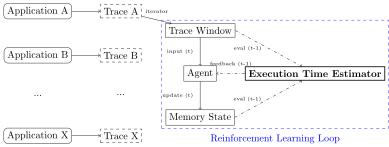

# MemAI: A Gym environment for training RL algrorithms to manage applications data with dynamic page migrations.

This project implements a gym environment where an AI receives memory
accesses from a trace of real application execution and chooses ranges of 
addresses to migrate from/to a DDR (slow) memory to/from a HBM (fast) 
memory with a limited capacity. Every time the AI moves data around, it is 
penalized, as in a real application execution, and its goal is to carefully 
chose the data to place into the fast HBM memory so as to minimize the 
application execution time.

The environment loop is summarized in below image and works as follow:
1. An application is run on a real machine with a slow memory (DDR) and
a fast memory (HBM) with its whole dataset in the slow memory while
its memory accesses are recorded through sampling hardware counters.
2. The same step is performed again but with the application dataset
stored in the HBM memory.
3. We can split the two traces into matching windows and evaluate what 
would have been the application execution time with a differential 
tracing method. The methodology for input traces collection and execution 
time estimation are described in our paper [1].
4. We pre-process the bundle of the two traces split into windows into
a trace of observation matrices and inputs for estimation of the window
execution time. We store the result into a new trace.
See the modules `memai.preprocessing` and `memai.observation` for 
implementation details of observations.
5. In the gym environment, we step through observations. For each step,
we can evaluate the window execution time as the result of the previous
allocations/free of the HBM memory by the AI. This execution time
is the first component of the reward for the current action.
6. From the previous step observation, the current AI action may results in 
moving some ranges of addresses. The cost of moving these pages is the 
second component of the reward.
7. We reiterate this protocol with different applications traces to train an
AI.
8. We evaluate the AI on the same protocol with some more applications traces.
9. Instead of generalizing to different applications we can use a single 
application and generalize to different input parameters such as the 
application working set size.



[1]: Rapid Execution Time Estimation for Heterogeneous Memory Systems through Differential Tracing, ISC 22'

## Directory Structure

#### ./memai

+ `./memai/__init__.py`:
Base module of imports to instanciate a gym environment: `Preprocessing`
to import a preprocessed application trace, and `GymEnv` to instanciate an
environment with the loaded trace.

+ `./memai/action.py`:
The definition of the environment action space and implementation of actions
execution. See module documentation for implementation details.

+ `./memai/observation.py`:
The definition of the environment observation space and implementation of 
the translation from timestamped memory accesses into an observation.
See module documentation for implementation details.

+ `./memai/estimator.py`:
This module contains the implementation of the execution time estimation 
for a set of memory
access arbitrarily mapped in HBM from execution times in DDR and HBM for
these accesses. This is used to provide the AI with feedback on its
mapping choices.

The module can be executed with to evaluate execution time against real
executions to check the accuracy of estimation.

```
python memai/estimator.py --help
```

+ `./memai/memory.py`:

This module contain the implementation of the memory piece of the gym
environment. The memory module keeps track of allocations/free
in the HBM and statistics on the memory access. It also provides the exact
amount of pages that actually needed to be allocated/freed when the AI
actions leads to such requests.

The memory capacity can be set to emulate situations where the application
dataset cannot fit entirely in the fast HBM memory.
Performance attributes of the memory cannot be changed since the simulation
relies on real executions performance with real memory performance.

+ `./memai/preprocessing.py`:

Script to convert raw traces of memory access into gym input traces of
observations and associated data for execution time estimation.

```
python memai/preprocessing.py --help
```

+ `./memai/traces.py`:

Module to read and iterate through raw traces of applications memory 
accesses. Traces loaded with this module are used as input in 
the estimation script or preprocessing script.

+ `./memai/interval.py`:

Module to incrementally build the set of contiguous address regions 
accessed by an application. This is used by the preprocessing script to 
split windows of memory accesses into `windows x regions` of memory 
accesses and build an observation for each element of this space.

+ `./memai/env.py`:

This is the module containing the gym environment implementation.
This script can be executed to unroll a trace based environment
with simple actions.

```
./memai/env.py --help
```

+ `./memai/ai.py`:

This is an example script containing an AI implementation that
can be trained and evaluated on input traces.

```
./memai/ai.py --help
```

+ `./memai/options.py`:

Common options for executable scripts.

#### ./data

Raw data collected from applications run.
See `memai.traces.Trace` module for details on the content of the traces.

#### ./utils

##### Legacy scripts: 

```
./utils/convert.sh
./utils/estimator_and_plotter.py
./utils/pebsview.py
./utils/plot_accesses.py
./utils/plot_csv.py
./utils/plot_csv_all.py
```

##### Preprocessing

`./utils/preprocessing.sh`: preprocess (with default arguments) all the 
traces in `./data` into traces of observation that can be used as input to 
the gym environment.

```
./utils/preprocessing.sh -h
```

##### Training / Inference

`./utils/ai.sh`: Train and evaluate an AI with a preset training set,  
test set and default environment arguments (e.g HBM memory size). 

```
./utils/ai.sh -h
```

## Tests

### Unit Tests

Some scripts can be directly executed as unit tests:
```
python -m unittest memai.action memai.memory memai.observation memai.interval
```
or
```
python memai/action.py
python memai/observation.py
python memai/memory.py
python memai/interval.py
```

### Integration Tests

Integration tests here are more of a visual assertion of expected range of 
values. They do not have a ground truth value to check against.

+ `python memai/estimator.py --ddr-input <file1> --hbm-input <file2> --hbm-ranges 0x000000000000-0x000000000001`
Should estimate execution time equal to the real DDR execution time.

+ `python memai/estimator.py --ddr-input <file1> --hbm-input <file2> --hbm-ranges 0x000000000000-0xffffffffffff`
Should estimate execution time roughly to the real HBM execution time.

+ `python memai/estimator.py --ddr-input <file1> --hbm-input <file2> --measured-input <file3>`
Should estimate execution time with a reasonable error compared to the measured input.

+ `python memai/env.py --input <file> --action all_ddr`
Should estimate execution time equal to the real DDR execution time with
no allocations in the HBM, no allocation overflow and a lot of double free.

+ `python memai/env.py --input <file> --action all_hbm`
Should estimate execution time roughly to the real HBM execution time with
allocations in the HBM matching the application dataset size and no frees.

+ `python memai/env.py --input <file> --action all_hbm --hbm-size 256`
Should match the allocated data size and hbm size (If the application 
data set size is bigger than 256MiB).

+ `python memai/ai.py train --input <file> --model-dir <save-directory>`
Should run the whole loading bar and save the resulting model.

+ `python memai/ai.py eval --input <file> --model-dir <save-directory>`
Should evaluate the simulated execution time with the trained model on the
same trace (hopefully the AI is efficient).
